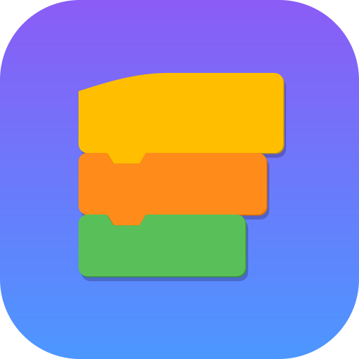
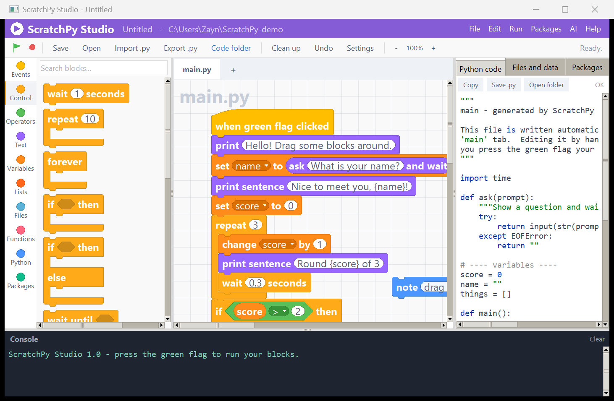
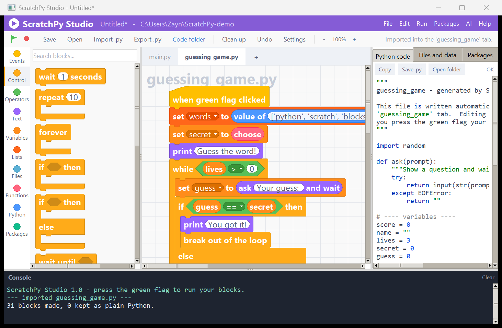
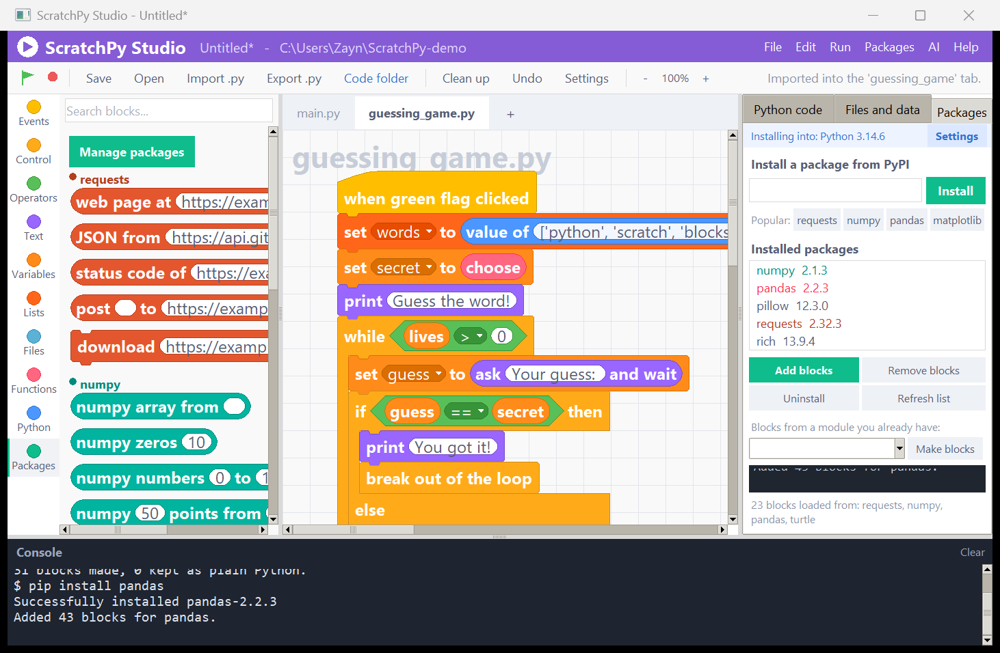
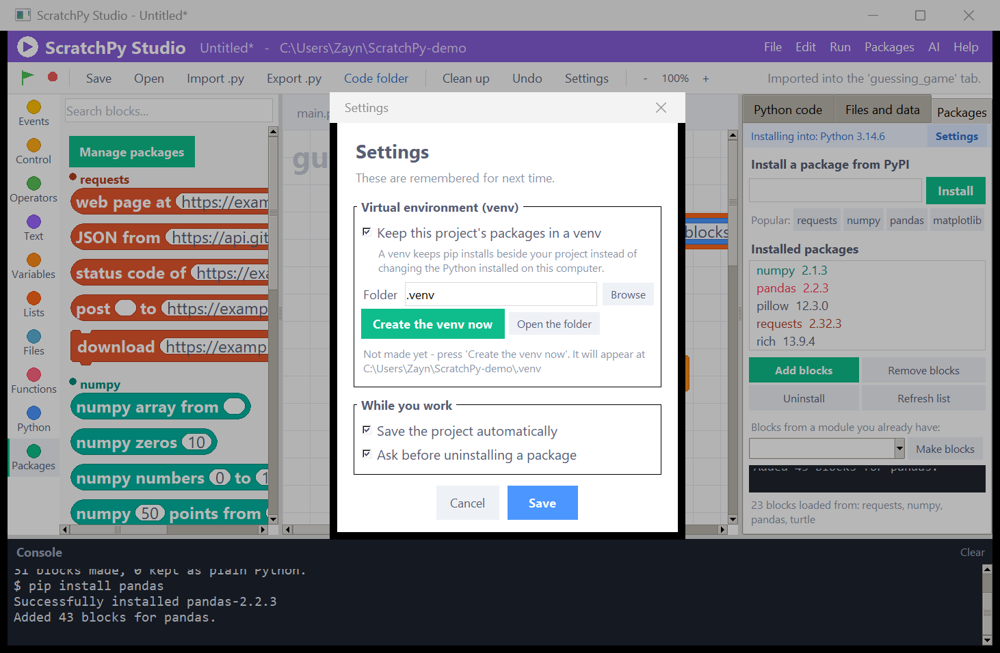
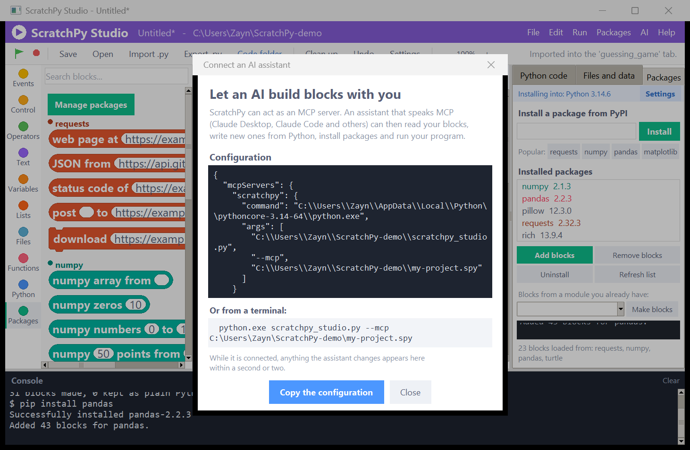
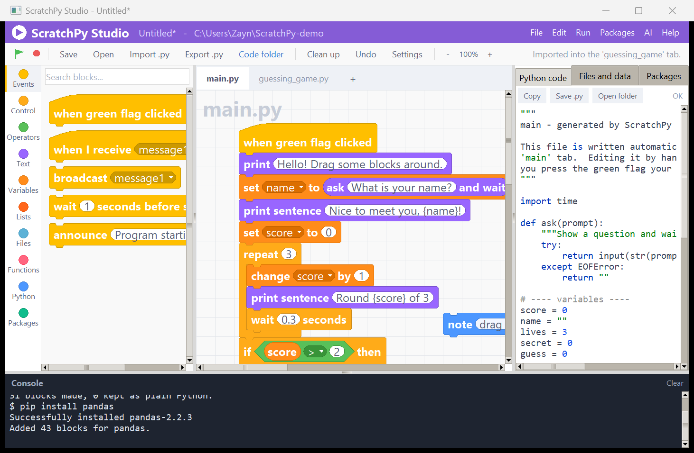

<div align="center">



# ScratchPy Studio

**Snap blocks together like Scratch. Get real Python out the other side.**

[](https://www.python.org/)
[](#)
[](scratchpy_studio.py)
[](#build-a-standalone-app)
[](LICENSE)



</div>

---

ScratchPy Studio is a complete Scratch-style visual programming environment that
writes, saves and runs **genuine Python**. Drag a block, and a real line of code
appears in the panel next to it. Press the green flag, and that code actually
runs.

It is a **single file** — `scratchpy_studio.py` — and it needs **nothing but the
Python standard library**.

```bash
python scratchpy_studio.py
```

---

## Why it is different

Most block editors are toys with their own private runtime. This one is a code
generator: everything you build lands in a `.py` file you can open, read, edit
and hand in.

|  | |
|---|---|
| 🧩 **135 blocks** | Hat blocks, C-shaped loops, hexagonal booleans, reporter ovals that drop into slots — the real Scratch 3 shapes and colours |
| 🐍 **Real Python, live** | The generated source updates as you drag. No hidden interpreter |
| ▶️ **It actually runs** | `print`, `input`, errors and a stop button, all wired to the built-in console |
| 📥 **Import any `.py`** | Turn a program you already have into blocks — loops, functions, try/except, f-strings and all |
| 📦 **Every PyPI package** | pip dashboard installs anything and turns it into blocks automatically |
| 🤖 **Works with AI** | Built-in MCP server so an assistant can build blocks alongside you |
| 🎨 **Looks the part** | Because half the point of Scratch is that it looks inviting |

---

## Bring your own Python

Press **Import .py** and pick any file. The whole program becomes blocks.

<div align="center">

</div>

Loops, conditions, functions, `try`/`except`, `with open(...)`, f-strings and
comparisons all become proper blocks. Classes, decorators and anything else
exotic are kept **word for word** inside "python code" blocks, so no program is
ever refused and nothing is ever silently lost. ScratchPy also notices which
packages the file imports and offers to install them and build blocks for them.

> Six sample programs were imported, turned back into Python and run: every one
> produced **byte-identical output** to the original. ScratchPy's own 6,700-line
> source imports into 1,793 blocks that still compile.

---

## Every package on PyPI, in its own colour

Type a name, press Install. ScratchPy inspects the package in a sandboxed
subprocess and builds a set of blocks for it — and gives each library its own
colour so your palette never turns into soup.

<div align="center">

</div>

* Popular libraries (**requests, numpy, pandas, matplotlib, pillow, pygame,
  turtle**) also get hand-written, friendlier blocks.
* Any importable module works — including standard library ones like `turtle`
  and `statistics`.
* **Remove blocks** takes a library out of the palette; **Uninstall** removes
  the package itself. Blocks you added stay put between sessions.

### Keep it tidy with a venv

<div align="center">

</div>

Flip the switch in **Settings** and every pip install, every introspection and
every run happens inside a `.venv` beside your project instead of touching the
Python installed on your computer.

---

## Let an AI build blocks with you

ScratchPy speaks the **Model Context Protocol**, so Claude Desktop, Claude Code
or any other MCP client can work in the same project you have open.

<div align="center">

</div>

```bash
python scratchpy_studio.py --mcp myproject.spy
```

| Tool | What the assistant can do |
|---|---|
| `write_python` | Hand it Python — it becomes blocks in a tab |
| `read_blocks` | Read a readable outline of what you have built |
| `read_code` | Read the Python your blocks generate |
| `run` | Run a tab and get the output back |
| `project_overview` · `set_variable` · `delete_file` · `import_python_file` | Project bookkeeping |
| `list_packages` · `install_package` · `add_package_blocks` · `remove_package_blocks` | pip and block packs |
| `list_block_types` | Every block ScratchPy knows and the Python each one makes |

The editor watches the project file, so anything the assistant changes shows up
in your workspace a second or two later. You can literally watch the blocks
appear.

---

## Getting started

### Run it from source

```bash
git clone https://github.com/ZDStudios/scratchpy-studio.git
cd scratchpy-studio
python scratchpy_studio.py
```

That is the whole install. No pip, no virtualenv, no build step.

### Or grab the app

Download `ScratchPyStudio.exe` from the
[latest release](../../releases/latest) and double-click it. It carries its own
Python, so it runs your block programs even on a computer that has none.

### Other switches

```bash
python scratchpy_studio.py --selftest       # build everything head-less, compile every block
python scratchpy_studio.py --make-icons     # write .png / .ico / .icns
python scratchpy_studio.py --mcp file.spy   # run as an MCP server
```

---

## Build a standalone app

```bash
python build_apps.py
```

| Run it on | You get |
|---|---|
| **Windows** | `dist/ScratchPyStudio.exe` — one file, double-click, no Python needed |
| **macOS** | `dist/ScratchPy Studio.app` plus a `.zip` beside it |
| **Linux** | `dist/ScratchPyStudio` plus a `.desktop` launcher and icon |

`build_apps.py` installs PyInstaller if it is missing, draws the icon and
bundles it into the app.

**PyInstaller cannot cross-compile** — a Mac app has to be built on a Mac. To
get all three without owning all three machines, use the included workflow:
open the **Actions** tab, choose *Build ScratchPy Studio apps* and press *Run
workflow*. It builds on Windows, macOS and Linux at once and attaches all three
as downloads.

---

## How it works

<div align="center">

</div>

Every block type is one `BlockSpec`: a shape, a row of mark-up describing its
label and inputs, and a template for the Python it produces.

```python
B("control_repeat", "control", "c", "repeat %n(times,10)",
  "for _ in range(int({times})):\n    {BODY0}")
```

That single definition gives you the orange C-shaped block, its editable number
slot, and the loop it compiles to. Adding a block is one line; a package pack is
a list of them generated by introspecting the module.

The compiler walks the blocks under each hat, collects the imports and runtime
helpers they need, works out which variables need a `global` declaration, and
writes a tidy module with a `main()` and an `if __name__ == "__main__":` guard.

### Testing

```bash
python scratchpy_studio.py --selftest
```

Builds the entire interface head-lessly, then **compiles every one of the 135
blocks**, checks the block definitions are well formed, round-trips a project
through save and load, exercises the Python importer and the MCP server, and
finally runs the generated example program and checks its output.

---

## What it puts on disk

| Name | What it holds |
|---|---|
| `<project folder>/*.py` | your generated Python, one file per tab |
| `scratchpy_blocks/` | cached block packs for packages you added |
| `scratchpy_assets/` | the generated icon files |
| `scratchpy_settings.json` | your preferences (venv, autosave, zoom) |
| `.venv/` | only if you switch the venv on in Settings |

Saving a project (a `.spy` file) puts the generated `.py` files next to it.
Until you save, they go next to the application.

---

## Keyboard

| | |
|---|---|
| `F5` | Run |
| `Esc` | Stop |
| `Ctrl` `S` / `Ctrl` `O` / `Ctrl` `N` | Save / Open / New |
| `Ctrl` `I` | Import a Python file |
| `Ctrl` `Z` | Undo |
| `Ctrl` `,` | Settings |
| Drag a block onto the palette | Delete it |
| Right-click the canvas | Clean up, delete all |

---

<div align="center">

MIT licensed · built with nothing but the Python standard library

</div>
