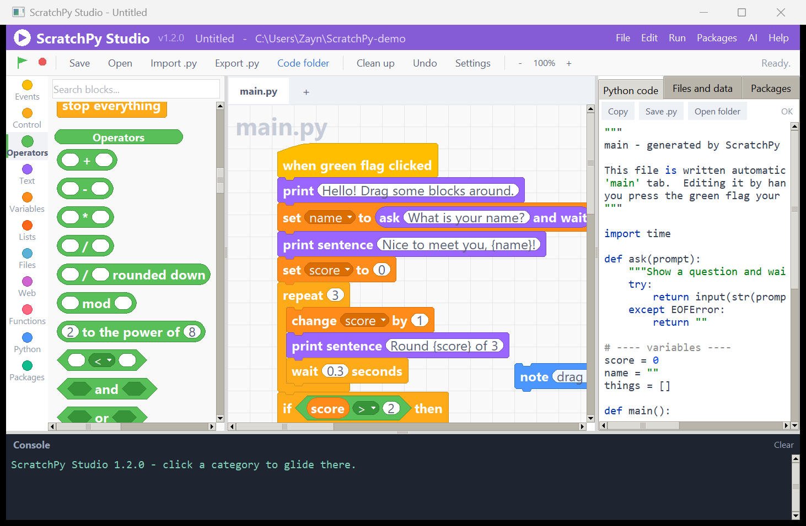
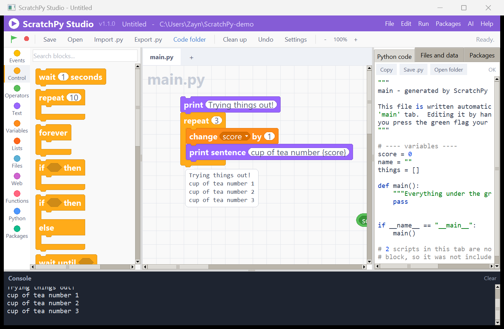
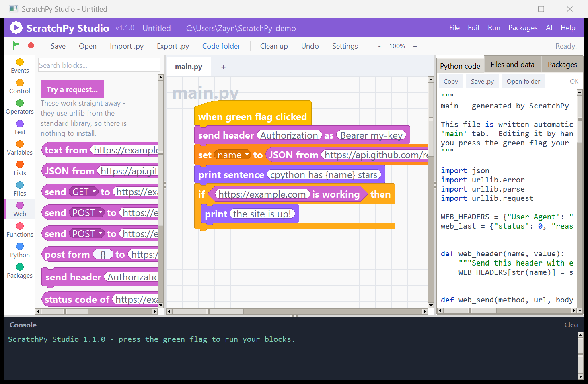
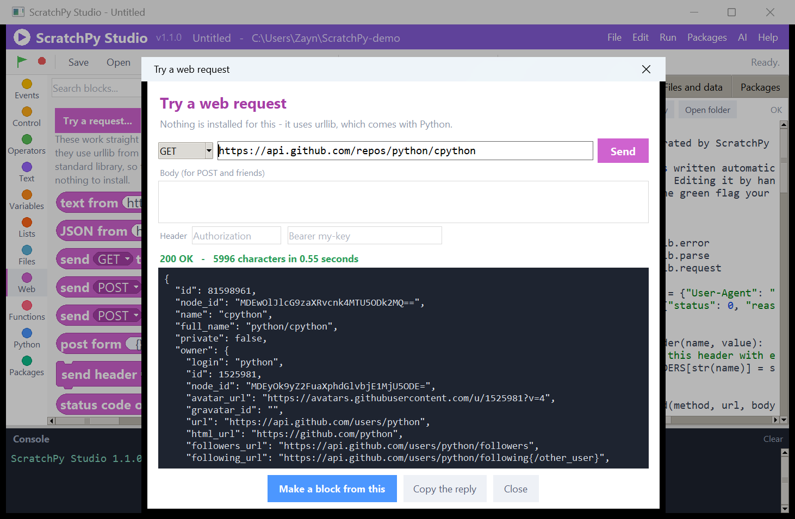
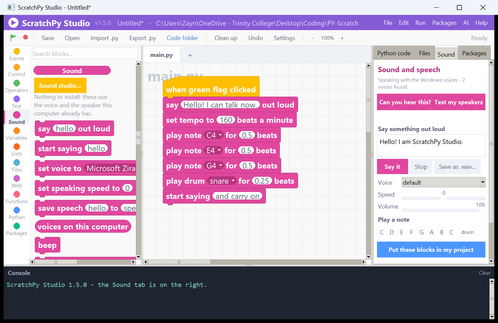
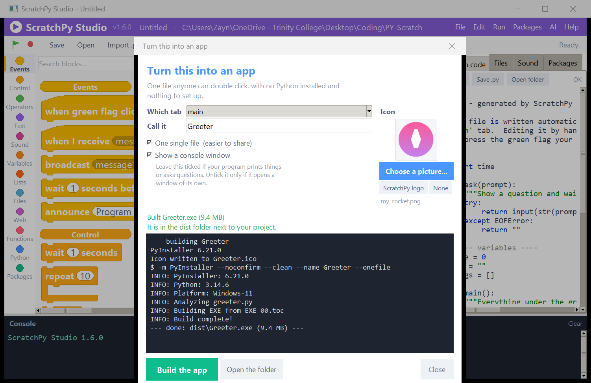
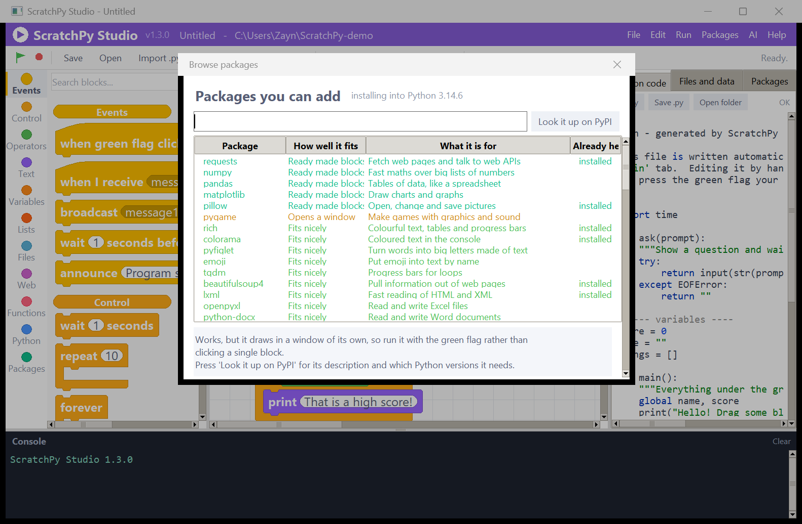
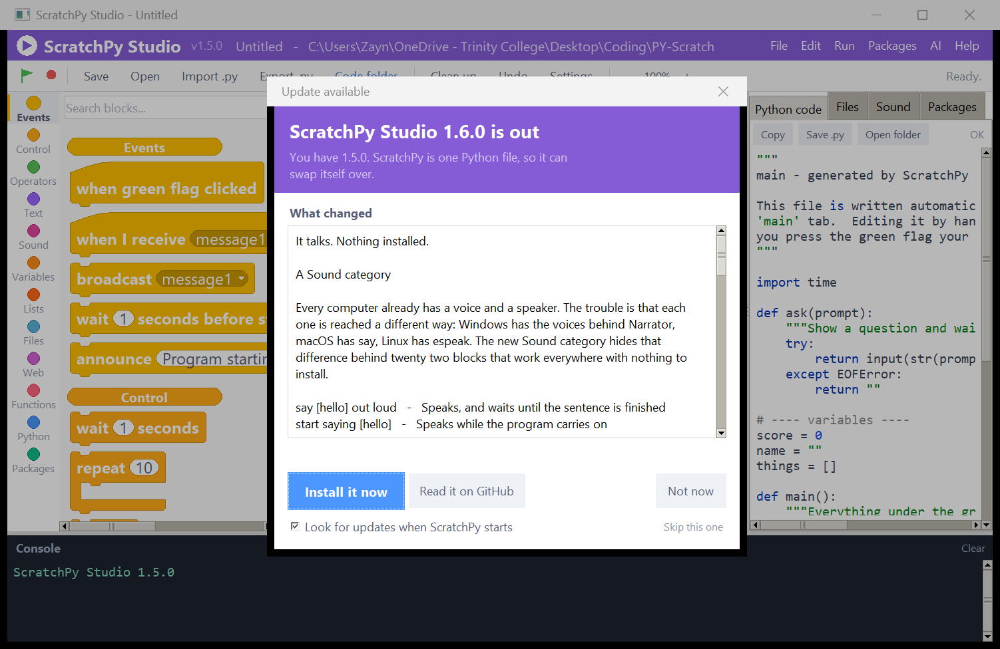

<div align="center">


# ScratchPy Studio

**Snap blocks together like Scratch. Get real Python out the other side.**

[](https://www.python.org/)
[](#)
[](scratchpy_studio.py)
[](https://github.com/ZDStudios/scratchpy-studio/actions/workflows/build-apps.yml)
[](https://github.com/ZDStudios/scratchpy-studio/releases/latest)
[](LICENSE)


</div>

---

ScratchPy Studio is a complete Scratch-style visual programming environment that
writes, saves and runs **genuine Python**. Drag a block, and a real line of code
appears in the panel next to it. Press the green flag, and that code actually
runs.

It is a **single file** — `scratchpy_studio.py` — and it needs **nothing but the
Python standard library**.

```bash
python scratchpy_studio.py
```

### 👉 [Try the browser demo](https://zdstudios.github.io/scratchpy-studio/) — no install, nothing to download

[`index.html`](index.html) is a standalone version of the same idea: one file, no
dependencies, no build step. 95 blocks, drag and snap, the Python appearing live
beside you, Run working right there in the page — and you can **drop a `.py` file
on it** and watch the whole program turn into blocks. The desktop app adds pip,
virtual environments, files, the web blocks and the MCP server.

---

## Why it is different

Most block editors are toys with their own private runtime. This one is a code
generator: everything you build lands in a `.py` file you can open, read, edit
and hand in.

|  | |
|---|---|
| 🧩 **177 blocks** | Hat blocks, C-shaped loops, hexagonal booleans, reporter ovals that drop into slots — the real Scratch 3 shapes and colours |
| 🐍 **Real Python, live** | The generated source updates as you drag. No hidden interpreter |
| ▶️ **It actually runs** | `print`, `input`, errors and a stop button, all wired to the built-in console |
| 👆 **Click a block to try it** | A loose block runs on its own and reports what it printed in a bubble underneath |
| 🌐 **Talks to the web out of the box** | GET, POST, headers, JSON, downloads — using `urllib` from the standard library, so there is nothing to install |
| 🔊 **It talks** | A Sound category that speaks, plays notes and beats drums — using the voice and speaker the computer already has |
| 📥 **Import any `.py`** | Turn a program you already have into blocks — loops, functions, try/except, f-strings and all |
| 📦 **Every PyPI package** | pip dashboard installs anything and turns it into blocks automatically |
| 📦 **Makes a real app** | One button turns your blocks into a double-clickable `.exe` — upload any picture and it becomes the icon |
| ⬆️ **Updates itself** | Looks for a newer version once a day, shows you what changed, and installs it when you say so |
| 🤖 **Works with AI** | Built-in MCP server so an assistant can build blocks alongside you |
| 🎨 **Looks the part** | Because half the point of Scratch is that it looks inviting |

---

## One drawer, gliding between sections

Every category lives in one continuous list, the way Scratch does it. Clicking a
category glides the drawer to that section instead of swapping the list out, and
scrolling by hand moves the highlight along with you.

<div align="center">

</div>

The rest of the app moves too, in small ways that are meant to be felt rather
than watched: the highlight slides between categories, blocks flash softly where
they click together, a deleted block shrinks away into the palette, report
bubbles pop in, and the green flag has a gentle heartbeat while your program
runs. A full rebuild of the whole drawer takes about 40 ms, so none of it gets in
your way — and **Settings** has a switch to turn all of it off.

---

## Click a block to try it

Blocks lying loose on the canvas are a scratch pad. Click one and it runs on its
own, with a little bubble underneath showing what it printed.

<div align="center">

</div>

* Click a **loose block or stack** → it runs from there down.
* Click a **reporter** (the oval ones) → the bubble shows its value.
* Click a **hat** → its whole script runs, the same as the green flag.
* Blocks that sit inside a script under a hat are left alone, so nothing runs by
  accident while you are building.

Mistakes are explained rather than dumped — the bubble shows
`ZeroDivisionError: division by zero` and the full traceback goes to the console.
Custom blocks, variables and packages all work, because the piece is compiled
with the same imports and definitions as the rest of the tab. Variables start
from their starting values each time, and anything still running after 15
seconds is stopped.

---

## The internet, with nothing installed

The **Web** category is built in. No `pip install requests`, no venv, no
waiting — it is `urllib` from the standard library dressed up as blocks.

<div align="center">

</div>

| Block | What it does |
|---|---|
| `text from [url]` | The page or API answer as text |
| `JSON from [url]` | The answer already turned into records and lists |
| `send (GET▾) to [url]` | The all-purpose API sender — GET, POST, PUT, PATCH, DELETE, HEAD |
| `send (POST▾) to [url] with JSON { }` | Send a record as a JSON body |
| `post form { } to [url]` | The kind of form a web page would send |
| `send header [name] as [value]` | Set it once; every request after it carries the header — this is where an API key goes |
| `status code of [url]` · `[url] is working` | 200, 404, or 0 when nothing answers |
| `download [url] to file [path]` | Save a picture or a file |
| `[base] with values { }` | Builds `...?q=cats&page=2` safely |
| `web safe [text]` | Percent-encodes anything for a URL |

A 404 still hands you the body, so you can read the error message an API sends
back. Only `http://` and `https://` addresses are accepted — a redirect cannot
be talked into reading a local file.

### Try it before you build it

**Run → Try a web request**, or the button at the top of the Web category:

<div align="center">

</div>

Pick a method, paste a URL, add a header, press Send. You get the status code,
how long it took, and the reply with JSON pretty-printed. **Make a block from
this** then drops the matching blocks straight into your workspace.

The tester runs the *same* helper functions your blocks compile to, so what you
test is exactly what your program will do.

---

## It talks. Nothing installed.

Every computer already has a voice and a speaker — the trouble is that each one
reaches them a different way. Windows has the voices behind Narrator, macOS has
`say`, Linux has `espeak`. The **Sound** category hides the difference, so one
block works on all three.

<div align="center">

</div>

| Block | What it does |
|---|---|
| `say [hello] out loud` | Speaks, and waits until the sentence is finished |
| `start saying [hello]` | Speaks while the program carries on |
| `set voice to (▾)` | The dropdown lists the voices *this* computer really has |
| `set speaking speed to (0)` | −10 is very slow, 10 is very fast |
| `save speech [hello] to [speech.wav]` | Keeps it as a real sound file |
| `play note (C4▾) for (0.5) beats` | Middle C is `C4` or `60`; `F#3` and `Bb4` work too |
| `play drum (snare▾) for (0.25) beats` | Twelve drums, synthesised from scratch |
| `play (440) Hz for (0.5) seconds` | Any frequency, plus sine, square, saw, triangle and noise |
| `set tempo to (120) beats a minute` · `rest for (0.25) beats` | Music timing, the way Scratch does it |
| `play sound [sound.wav]` · `start sound [sound.wav]` | Your own files — `.wav` everywhere, `.mp3` on Windows and macOS |
| `stop all sounds` · `set volume to (100) percent` | Silence, and loudness |

Tones, notes and drums are worked out one sample at a time and written as real
`.wav` files, so there is no synthesiser to install either. Each one is
calculated once and then reused, so a note inside a loop stays fast.

### Can you hear this?

The **Sound** tab on the right is a place to make a noise *now*, before you have
built anything:

- **Test my speakers** plays three notes. If you hear nothing, the problem is
  the mute switch or the output device, not your program — and it says so.
- Type a sentence, pick a voice, drag the speed and volume, press **Say it**.
- A little keyboard for trying notes and a drum.
- **Put these blocks in my project** drops blocks that do exactly what you just
  heard, sliders and all.

It runs the *same* helper functions your blocks compile to, so what you hear in
the tab is what your program will do.

> Using `pyttsx3` instead? Its catch is that nothing is heard until
> `runAndWait()` is called. ScratchPy now ships hand-written blocks for it that
> always do both — as it does for `gtts` and `playsound`.

---

## Ship it as an app

**Build .exe** on the toolbar turns the tab you are on into an application
anyone can double-click — no Python installed, nothing to set up.

<div align="center">

</div>

**Choose a picture** and it becomes the icon. ScratchPy reads the PNG itself,
with nothing but `zlib` — every colour type, every bit depth, every line filter,
transparency and all. It centres the picture in a square, box-filters it down to
seven sizes and writes a proper multi-size `.ico` (and `.icns` on macOS). GIF
goes through Tk; a JPEG needs Pillow, and ScratchPy offers to install it rather
than pretending it can.

The one thing here that is not standard library is PyInstaller. ScratchPy checks
whether it is there, offers to fetch it with the same pip the Packages tab uses,
and shows the whole build log as it happens. The finished app lands in `dist/`
next to your project, and **Open the folder** takes you to it.

* **One single file** — easier to hand to someone, slower to start.
* **Show a console window** — leave it on if your program prints or asks
  questions; turn it off only if it opens a window of its own.
* Build tools work in the system temp folder, not in your project, because
  OneDrive and Dropbox lock files while they sync and PyInstaller trips over it.

---

## Bring your own Python

Press **Import .py** and pick any file. The whole program becomes blocks.

<div align="center">

</div>

Loops, conditions, functions, `try`/`except`, `with open(...)`, f-strings and
comparisons all become proper blocks. Classes, decorators and anything else
exotic are kept **word for word** inside "python code" blocks, so no program is
ever refused and nothing is ever silently lost. ScratchPy also notices which
packages the file imports and offers to install them and build blocks for them.

> Six sample programs were imported, turned back into Python and run: every one
> produced **byte-identical output** to the original. ScratchPy's own 6,700-line
> source imports into 1,793 blocks that still compile.

---

## Every package on PyPI, in its own colour

Type a name, press Install. ScratchPy inspects the package in a sandboxed
subprocess and builds a set of blocks for it — and gives each library its own
colour so your palette never turns into soup.

<div align="center">

</div>

### A shelf to browse

<div align="center">

</div>

**Packages → Browse packages** opens a shelf of around 85 libraries worth
trying, each with a plain description and an honest note about **how well it
fits block programming**:

| | |
|---|---|
| **Ready made blocks** | ScratchPy has hand-written blocks for it |
| **Fits nicely** | its functions turn into blocks cleanly |
| **Opens a window** | works, but draws in a window of its own |
| **Needs hardware** | works, but wants a device plugged in |
| **Hard to use as blocks** | installs fine, but its ideas do not map well |

Anything already installed, or already turned into blocks, is marked. Type any
name at all and **Look it up on PyPI** fetches its real description, version and
`requires-python`, and tells you whether **your** Python can run it — so you
find out before installing, not after.

* Popular libraries (**requests, numpy, pandas, matplotlib, pillow, pygame,
  turtle**) also get hand-written, friendlier blocks.
* Any importable module works — including standard library ones like `turtle`
  and `statistics`.
* **Remove blocks** takes a library out of the palette; **Uninstall** removes
  the package itself. Blocks you added stay put between sessions.

### Keep it tidy with a venv

<div align="center">

</div>

Flip the switch in **Settings** and every pip install, every introspection and
every run happens inside a `.venv` beside your project instead of touching the
Python installed on your computer.

---

## Let an AI build blocks with you

ScratchPy speaks the **Model Context Protocol**, so Claude Desktop, Claude Code
or any other MCP client can work in the same project you have open.

<div align="center">

</div>

```bash
python scratchpy_studio.py --mcp myproject.spy
```

| Tool | What the assistant can do |
|---|---|
| `write_python` | Hand it Python — it becomes blocks in a tab |
| `read_blocks` | Read a readable outline of what you have built |
| `read_code` | Read the Python your blocks generate |
| `run` | Run a tab and get the output back |
| `project_overview` · `set_variable` · `delete_file` · `import_python_file` | Project bookkeeping |
| `list_packages` · `install_package` · `add_package_blocks` · `remove_package_blocks` | pip and block packs |
| `list_block_types` | Every block ScratchPy knows and the Python each one makes |

The editor watches the project file, so anything the assistant changes shows up
in your workspace a second or two later. You can literally watch the blocks
appear.

---

## Getting started

### Run it from source

```bash
git clone https://github.com/ZDStudios/scratchpy-studio.git
cd scratchpy-studio
python scratchpy_studio.py
```

That is the whole install. No pip, no virtualenv, no build step.

### Or grab the app

No Python at all? Take one from the
[latest release](https://github.com/ZDStudios/scratchpy-studio/releases/latest):

| Platform | File | How to run it |
|---|---|---|
| **Windows** | `ScratchPyStudio.exe` | Double-click it |
| **macOS** | `ScratchPy-Studio-macOS.zip` | Unzip, then right-click → *Open* the first time |
| **Linux** | `ScratchPy-Studio-Linux.zip` | Unzip, `chmod +x ScratchPyStudio`, run it |

Each build carries its own Python, so your block programs run even on a machine
that has none. (Installing packages with pip still wants a normal Python.)

### It keeps itself up to date

Once a day, quietly, ScratchPy asks GitHub whether there is a newer version. If
there is, it says so — once — and offers to go and get it.

<div align="center">

</div>

**Install it now** does the whole thing:

* Running from source? ScratchPy is a single `.py` file, so it downloads the new
  one, **checks it compiles and really is ScratchPy at the version it claims**,
  keeps your old copy as `scratchpy_studio.previous.py`, and swaps it over.
* Running the app? The new build is downloaded, checked against the size GitHub
  published, and moved into place — the old one is kept beside it as
  `.previous`. On Windows a running `.exe` cannot be written over, but it *can*
  be renamed, which is exactly what happens.
* Then **Restart now** closes tidily (asking about unsaved work first) and opens
  the version you just installed.

Nothing is downloaded, and nothing is replaced, until you press the button.

The rules it will not bend: **https only**, and **only github.com** — checked
before the request and again after the redirect GitHub sends downloads through.
A file that does not compile, does not contain ScratchPy, or carries a different
version from the release it came from is thrown away rather than installed.

**Help → Check for updates** asks straight away. **Settings** has a switch for the
daily look, and the popup has *Skip this one* if you would rather stay put.

> On a school or office network that inspects secure traffic, the download hosts
> may be unreachable even when github.com is not. ScratchPy says so in plain
> words and points you at a browser, which will get through.

### Which version am I running?

The version sits next to the name in the purple bar, and **Settings → About this
copy** shows the exact file it is running from, when that file was last changed,
and a **Check for updates** button that asks GitHub. From a terminal:

```bash
python scratchpy_studio.py --version
```

```
ScratchPy Studio 1.0.2
Running from the source file:
  C:\...\scratchpy_studio.py
  last changed 05 Aug 2026, 12:23
Python 3.14.6, Tk 8.6, Windows 11
125 blocks loaded
```

Handy when you have both a checkout and a downloaded app on the same machine and
want to know which one you just opened.

### Other switches

```bash
python scratchpy_studio.py --selftest       # build everything head-less, compile every block
python scratchpy_studio.py --make-icons     # write .png / .ico / .icns
python scratchpy_studio.py --mcp file.spy   # run as an MCP server
```

---

## Build a standalone app

```bash
python build_apps.py
```

| Run it on | You get |
|---|---|
| **Windows** | `dist/ScratchPyStudio.exe` — one file, double-click, no Python needed |
| **macOS** | `dist/ScratchPy Studio.app` plus a `.zip` beside it |
| **Linux** | `dist/ScratchPyStudio` plus a `.desktop` launcher and icon |

`build_apps.py` installs PyInstaller if it is missing, draws the icon and
bundles it into the app.

**PyInstaller cannot cross-compile** — a Mac app has to be built on a Mac. To
get all three without owning all three machines, use the included workflow:
open the **Actions** tab, choose *Build ScratchPy Studio apps* and press *Run
workflow*. It builds on Windows, macOS and Linux at once and attaches all three
as downloads.

---

## How it works

<div align="center">

</div>

Every block type is one `BlockSpec`: a shape, a row of mark-up describing its
label and inputs, and a template for the Python it produces.

```python
B("control_repeat", "control", "c", "repeat %n(times,10)",
  "for _ in range(int({times})):\n    {BODY0}")
```

That single definition gives you the orange C-shaped block, its editable number
slot, and the loop it compiles to. Adding a block is one line; a package pack is
a list of them generated by introspecting the module.

The compiler walks the blocks under each hat, collects the imports and runtime
helpers they need, works out which variables need a `global` declaration, and
writes a tidy module with a `main()` and an `if __name__ == "__main__":` guard.

### Testing

```bash
python scratchpy_studio.py --selftest
```

Builds the entire interface head-lessly, then **compiles every one of the 177
blocks**, checks the block definitions are well formed, round-trips a project
through save and load, exercises the Python importer and the MCP server, and
finally runs the generated example program and checks its output.

---

## The browser demo

[`index.html`](index.html) is a self-contained demo you can open by
double-clicking it, or visit at
**[zdstudios.github.io/scratchpy-studio](https://zdstudios.github.io/scratchpy-studio/)**.

It shares the desktop app's ideas in about 3,400 lines of HTML, CSS and
JavaScript with **no dependencies and no build step**:

* **95 blocks** across eight categories — the same Scratch 3 shapes, drawn as SVG
  paths from the same puzzle geometry
* one continuous drawer that glides between sections
* drag, snap, C-shaped mouths, reporters that drop into slots
* the Python it makes, updating live beside you — copy it or save it as a `.py`
* a small interpreter so **Run** actually works in the page, and clicking a loose
  block still shows its answer in a bubble
* **it reads Python too** — see below

Each block is described once, and that single description drives all three
things: how it is drawn, the Python it generates, and how it runs. It works with
a mouse, a pen or a finger.

### Import a Python file, in the browser

Press **Import .py**, paste a program, or just drop a `.py` file onto the page.
A small tokeniser and recursive-descent parser — written from scratch in
JavaScript, since browsers have no `ast` module — reads the file and builds the
blocks.

It understands assignments, `if`/`elif`/`else`, `while`, `for` over `range` and
over lists, `def` with parameters and returns, `break`, `continue`, f-strings,
comparisons, `and`/`or`/`not`, list and string methods, and the usual built-ins.
Functions become real **custom blocks** with their own define hat and call block.
Anything it does not recognise is kept word for word in a "python" block, so no
file is ever refused.

> Six programs were tested three ways: run by real Python, imported into blocks
> and run by the demo's own interpreter, then turned back into Python and run
> again. All three produce **identical output** every time.

What the demo leaves out: pip, virtual environments, files, the web blocks and
the MCP server. Those need a machine, not a tab — they are in the desktop app.

---

## What it puts on disk

| Name | What it holds |
|---|---|
| `<project folder>/*.py` | your generated Python, one file per tab |
| `scratchpy_blocks/` | cached block packs for packages you added |
| `scratchpy_assets/` | the generated icon files |
| `scratchpy_settings.json` | your preferences (venv, autosave, zoom) |
| `.venv/` | only if you switch the venv on in Settings |

Saving a project (a `.spy` file) puts the generated `.py` files next to it.
Until you save, they go next to the application.

---

## Keyboard

| | |
|---|---|
| `F5` | Run |
| `Esc` | Stop |
| `Ctrl` `S` / `Ctrl` `O` / `Ctrl` `N` | Save / Open / New |
| `Ctrl` `I` | Import a Python file |
| `Ctrl` `Z` | Undo |
| `Ctrl` `,` | Settings |
| Click a loose block | Run just that block and see what it printed |
| Drag a block onto the palette | Delete it |
| Right-click the canvas | Clean up, delete all |

---

<div align="center">

MIT licensed · built with nothing but the Python standard library

</div>
